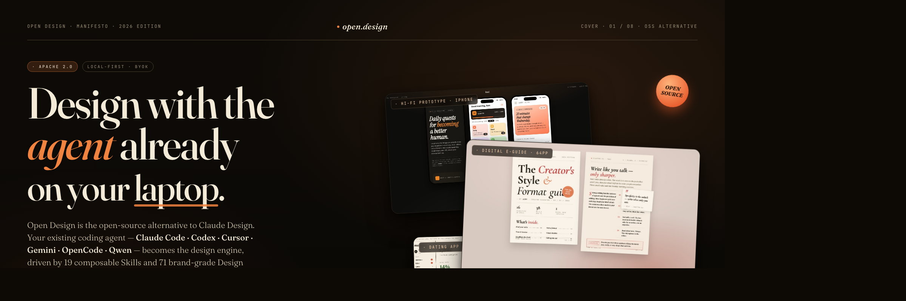

# Open Design 한국어 버전

> **[Claude Design][cd]의 오픈소스 대안.** 로컬 우선, GitHub로 공유하기 쉬운 디자인 에이전트 앱입니다. 이미 설치해 둔 코딩 에이전트(Claude Code, Codex, Cursor Agent, Gemini CLI, OpenCode, Qwen)가 디자인 엔진이 되고, **19개 조합형 Skill**과 **71개 브랜드급 Design System**이 결과물을 이끕니다.

<p align="center">
  
</p>

<p align="center"><a href="README.md">English</a> · <a href="README.zh-CN.md">简体中文</a> · <b>한국어</b></p>

---

## 사람들에게 공유할 때

이 프로젝트는 서버에 올려 쓰는 SaaS가 아니라 **Local-First GitHub 프로젝트**입니다. 아래 URL을 공유하고, 받는 사람은 로컬에서 한 줄로 실행하면 됩니다.

```text
https://github.com/NewTurn2017/open-design
```

```bash
git clone https://github.com/NewTurn2017/open-design.git
cd open-design
pnpm install
pnpm dev
```

`pnpm dev`는 daemon(`:7456`)과 Vite 웹 앱(`:5173`)을 같이 실행하고 브라우저를 자동으로 엽니다. 브라우저가 자동으로 열리지 않으면 `http://localhost:5173`으로 접속하면 됩니다.

## 한국어 포크에서 달라진 점

- 첫 실행 기본 언어를 `ko-KR`로 설정했습니다.
- 앱의 주요 버튼, 설정, 새 프로젝트 패널, 채팅, 파일 뷰어, 질문 폼, 디자인 시스템 탐색 UI를 한국어로 제공합니다.
- 디자인 시스템 카테고리와 쇼케이스/토큰 미리보기의 주요 안내 문구를 한국어로 표시합니다.
- 기술 식별자, CLI 이름, API 키, 모델명, 경로, 파일명, 코드/토큰 값은 번역하지 않고 그대로 유지합니다.
- 원본 Open Design upstream(`nexu-io/open-design`)을 `upstream` remote로 연결해 최신 변경을 계속 받아올 수 있게 했습니다.

## 빠른 시작

```bash
pnpm install
pnpm dev
```

첫 화면에서 로컬 코드 에이전트 CLI를 자동 감지합니다. 감지된 에이전트를 선택하거나 Anthropic API(BYOK)를 사용할 수 있습니다. 디자인 종류와 디자인 시스템을 고른 뒤 프롬프트를 입력하면, 에이전트가 산출물을 만들고 오른쪽 미리보기 패널에 렌더링합니다.

## 주요 명령

```bash
pnpm dev            # daemon + Vite를 함께 실행하고 브라우저 열기
pnpm daemon         # daemon만 실행
pnpm dev:web        # Vite 프론트엔드만 실행
pnpm dev:all        # pnpm dev와 동일한 호환 alias
pnpm typecheck      # TypeScript 검사
pnpm build          # 프로덕션 빌드
pnpm start          # 빌드 후 daemon이 dist/를 로컬에서 서빙
```

## 로컬 퍼스트 동작 방식

- `.od/` 아래에 로컬 SQLite DB, 프로젝트 파일, 생성 산출물이 저장됩니다.
- 코딩 에이전트 CLI는 사용자의 로컬 머신에서 실행됩니다.
- GitHub URL은 설치/실행 안내를 공유하기 위한 배포 채널이고, 실제 디자인 생성은 각 사용자의 로컬 환경에서 일어납니다.

## Upstream 동기화

이 포크는 다음 remote 구성을 기준으로 작업합니다.

```bash
git remote -v
# origin   https://github.com/NewTurn2017/open-design.git
# upstream https://github.com/nexu-io/open-design.git
```

upstream 변경을 반영할 때는 다음 순서로 진행하세요.

```bash
git fetch upstream
git merge upstream/main
pnpm typecheck
pnpm build
```

## 번역 원칙

- 사용자가 눈으로 보는 UI 문구는 한국어 우선으로 둡니다.
- `Open Design`, `Claude Code`, `Codex`, `Anthropic API`, `BYOK`, `DESIGN.md`, `SKILL.md`, `Base URL`처럼 제품명/프로토콜/파일명/설정 키는 그대로 둡니다.
- 에이전트가 읽어야 하는 내부 프롬프트 규칙은 안정성을 위해 영어를 보존하되, 사용자가 실제로 보는 질문 폼/선택지/미리보기 크롬은 한국어로 둡니다.

[cd]: https://www.anthropic.com/news/claude-design
